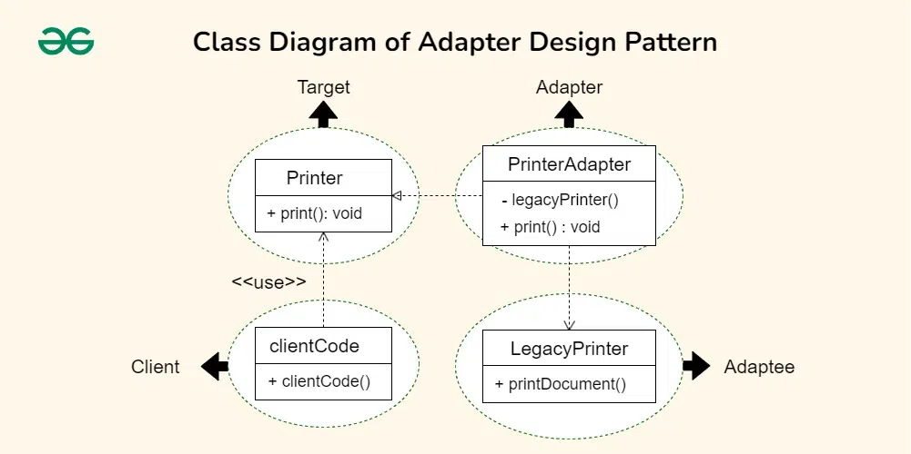

# Adapter Pattern

The Adapter design pattern is a structural pattern that allows the interface of an existing class to be used as another interface. It acts as a bridge between two incompatible interfaces, making them work together. This pattern involves a single class, known as the adapter, which is responsible for joining functionalities of independent or incompatible interfaces.

## Table of Contents

1. [Components](#components)
    - [Target Interface](#target-interface)
    - [Adaptee](#adaptee)
    - [Adapter](#adapter)
    - [Client](#client)

2. [Implementation](#implementation)
    - [Target Interface (Printer)](#target-interface-printer)
    - [Adaptee (LegacyPrinter)](#adaptee-legacyprinter)
    - [Adapter (PrinterAdapter)](#adapter-printeradapter)
    - [Client Code](#client-code)

## Components
### Target Interface
 Defines the interface expected by the client. It represents the set of operations that the client code can use.
### Adaptee
The existing class or system with an incompatible interface that needs to be integrated into the new system.
### Adapter
 A class that implements the target interface and internally uses an instance of the adaptee to make it compatible with the target interface.
### Client
The code that uses the target interface to interact with objects. It remains unaware of the specific implementation details of the adaptee and the adapter.

## Implementation

### Target Interface (Printer)
```java

```
### Adaptee (LegacyPrinter)
### Adapter (PrinterAdapter)
### Client Code