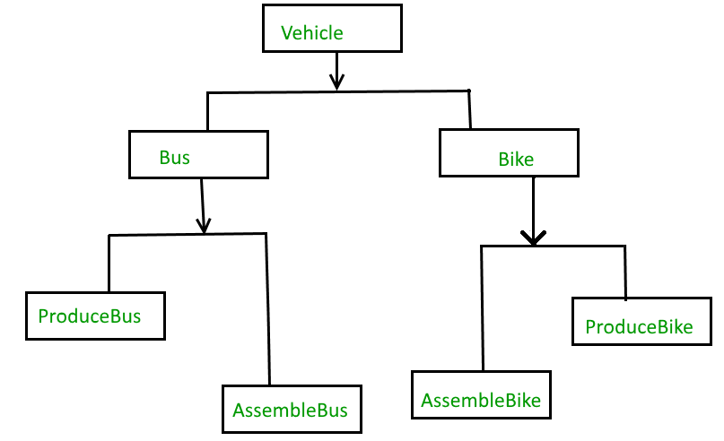
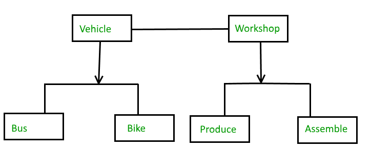

# Bridge Design Pattern

The bridge pattern allows the Abstraction and the Implementation to be developed independently and the client code can access only the Abstraction part without being concerned about the Implementation part. The abstraction is an interface or abstract class and the implementer is also an interface or abstract class. The abstraction contains a reference to the implementer. Children of the abstraction are referred to as refined abstractions, and children of the implementer are concrete implementers. Since we can change the reference to the implementer in the abstraction, we are able to change the abstraction’s implementer at run-time. Changes to the implementer do not affect client code.
It increases the loose coupling between class abstraction and it’s implementation.

## Table of Contents

1. [When we need bridge design pattern](#when-we-need-bridge-design-pattern)
2. [Elements of the Bridge Design Pattern](#elements-of-the-bridge-design-pattern)
3. [Implementation](#implementation)

## When we need bridge design pattern

Suppose we have the following structure:


If you want to change the Bus class, then you may end up changing ProduceBus and AssembleBus as well and if the change is workshop specific then you may need to change the Bike class as well.
You can solve the above problem by decoupling the Vehicle and Workshop interfaces in the below manner.



## Elements of the Bridge Design Pattern

-   **Abstraction**: core of the bridge design pattern and defines the crux. Contains a reference to the implementer.
-   **Refined Abstraction**: Extends the abstraction takes the finer detail one level below. Hides the finer elements from implementers.
-   **Implementer**: It defines the interface for implementation classes. This interface does not need to correspond directly to the abstraction interface and can be very different. Abstraction imp provides an implementation in terms of operations provided by the Implementer interface.
-   **Concrete Implementation**: Implements the above implementer by providing the concrete implementation.

## Implementation

```java
// Java code to demonstrate
// bridge design pattern

// abstraction in bridge pattern
abstract class Vehicle {
	protected Workshop workShop1;
	protected Workshop workShop2;

	protected Vehicle(Workshop workShop1, Workshop workShop2)
	{
		this.workShop1 = workShop1;
		this.workShop2 = workShop2;
	}

	abstract public void manufacture();
}

// Refine abstraction 1 in bridge pattern
class Car extends Vehicle {
	public Car(Workshop workShop1, Workshop workShop2)
	{
		super(workShop1, workShop2);
	}

	@Override
	public void manufacture()
	{
		System.out.print("Car ");
		workShop1.work();
		workShop2.work();
	}
}

// Refine abstraction 2 in bridge pattern
class Bike extends Vehicle {
	public Bike(Workshop workShop1, Workshop workShop2)
	{
		super(workShop1, workShop2);
	}

	@Override
	public void manufacture()
	{
		System.out.print("Bike ");
		workShop1.work();
		workShop2.work();
	}
}

// Implementer for bridge pattern
interface Workshop
{
	abstract public void work();
}

// Concrete implementation 1 for bridge pattern
class Produce implements Workshop {
	@Override
	public void work()
	{
		System.out.print("Produced");
	}
}

// Concrete implementation 2 for bridge pattern
class Assemble implements Workshop {
	@Override
	public void work()
	{
		System.out.print(" And");
		System.out.println(" Assembled.");
	}
}

// Demonstration of bridge design pattern
class BridgePattern {
	public static void main(String[] args)
	{
		Vehicle vehicle1 = new Car(new Produce(), new Assemble());
		vehicle1.manufacture();
		Vehicle vehicle2 = new Bike(new Produce(), new Assemble());
		vehicle2.manufacture();
	}
}
```
