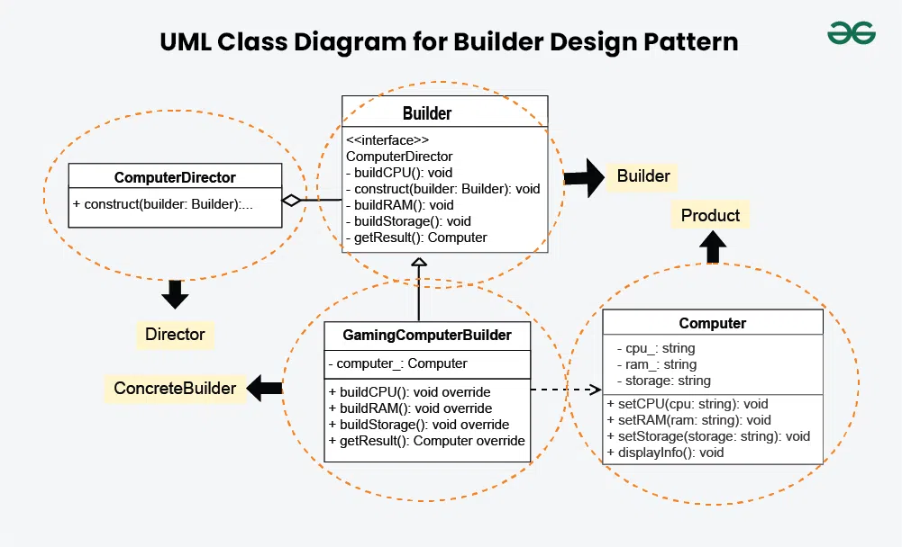

# Builder Design Pattern
The Builder Design Pattern is a creational pattern used in software design to construct a complex object step by step. It allows the construction of a product in a step-by-step fashion, where the construction process can vary based on the type of product being built. The pattern separates the construction of a complex object from its representation, allowing the same construction process to create different representations.

## Table of Contents

1. [Components](#components)
    - [Product](#product)
    - [Builder](#builder)
    - [ConcreteBuilder](#concrete-builder)
    - [Director](#director)
    - [Client](#client)
2. [Implementation](#implementation)
    - [Computer](#computer)
    - [Builder](#builder-implementation)
    - [GamingComputerBuilder](#gamingcomputerbuilder)
    - [Director](#director-implementation)
    - [Client](#client-implementation)

## Components
### Product
The **Product** is the complex object that the Builder pattern is responsible for constructing.
- It may consist of multiple components or parts, and its structure can vary based on the implementation.
- The Product is typically a class with attributes representing the different parts that the Builder constructs.
### Builder
The **Builder** is an interface or an abstract class that declares the construction steps for building a complex object.
- It typically includes methods for constructing individual parts of the product.
- By defining an interface, the Builder allows for the creation of different concrete builders that can produce variations of the product.
### ConcreteBuilder
**ConcreteBuilder** classes implement the Builder interface, providing specific implementations for building each part of the product.
- Each ConcreteBuilder is tailored to create a specific variation of the product.
- It keeps track of the product being constructed and provides methods for setting or constructing each part.
### Director
The **Director** is responsible for managing the construction process of the complex object.
- It collaborates with a Builder, but it doesn’t know the specific details about how each part of the object is constructed.
- It provides a high-level interface for constructing the product and managing the steps needed to create the complex object.
### Client
The Client is the code that initiates the construction of the complex object.
- It creates a Builder object and passes it to the Director to initiate the construction process.
- The Client may retrieve the final product from the Builder after construction is complete.
## Implementation

### Computer
```py
class Computer:
    cpu: str
    ram: str
    storage: str
    
    def __init__(self) -> None:
        self.cpu = ''
        self.ram = ''
        self.storage = ''
    
    def set_cpu(self, cpu: str) -> None:
        self.cpu = cpu
        
    def set_ram(self, ram: str) -> None:
        self.ram = ram
        
    def set_storage(self, storage: str) -> None:
        self.storage = storage
        
    def display_info(self) -> None:
        print("Computer configuration:")
        print(f"CPU: {self.cpu}")
        print(f"RAM: {self.ram}")
        print(f"Storage: {self.storage}")
```
### Builder Implementation
```py
from abc import ABC, abstractmethod

class Builder(ABC):
    @abstractmethod
    def build_cpu(self):
        pass

    @abstractmethod
    def build_ram(self):
        pass

    @abstractmethod
    def build_storage(self):
        pass

    @abstractmethod
    def get_result(self):
        pass
```
### GamingComputerBuilder
```py
from Builder import Builder
from Computer import Computer

class GamingComputerBuilder(Builder):
    
    computer: Computer = Computer()
    
    def build_cpu(self) -> None:
        self.computer.set_cpu('Intel Core i9-9900K')
        
    def build_ram(self) -> None:
        self.computer.set_ram('Corsair Vengeance LPX 16GB')
        
    def build_storage(self) -> None:
        self.computer.set_storage('Seagate Barracuda 2TB')
        
    def get_result(self) -> Computer:
        return self.computer
```
### Director Implementation
```py
from GamingComputerBuilder import GamingComputerBuilder
from Builder import Builder

class Director:
    def construct(self, builder: Builder) -> None:
        builder.build_cpu()
        builder.build_ram()
        builder.build_storage()
```
### Client Implementation
```py
from GamingComputerBuilder import GamingComputerBuilder
from OfficeComputerBuilder import OfficeComputerBuilder
from Director import Director
from Builder import Builder
from Computer import Computer

def main() -> None:
    gaming_computer_builder: Builder = GamingComputerBuilder()
    director = Director()
    
    director.construct(gaming_computer_builder)
    gaming_computer: Computer = gaming_computer_builder.get_result()
    
    gaming_computer.display_info()
    
    office_computer_builder: Builder = OfficeComputerBuilder()
    
    director.construct(office_computer_builder)
    office_computer: Computer = office_computer_builder.get_result()
    
    office_computer.display_info()
    

if __name__ == '__main__':
    main()
```