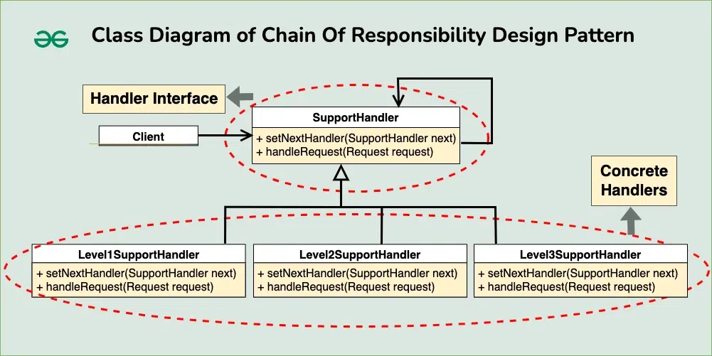

# Chain of Responsibility Design Pattern

The Chain of Responsibility design pattern is a behavioral design pattern that allows an object to pass a request along a chain of handlers. Each handler in the chain decides either to process the request or to pass it along the chain to the next handler.

## Table of Contents

1.  [Real-World Analogy of the Chain Of Responsibility Design Pattern](#real-world-analogy-of-the-chain-of-responsibility-design-pattern)
2.  [Components of the Chain of Responsibility Design Pattern](#components-of-the-chain-of-responsibility-design-pattern)
3.  [Implementation](#implementation)

## Real-World Analogy of the Chain Of Responsibility Design Pattern

Imagine a customer service department with multiple levels of support staff, each responsible for handling different types of customer inquiries based on their complexity. The chain of responsibility can be illustrated as follows:

-   **Level 1 Support**:
    -   This represents the first point of contact for customer inquiries. Level 1 support staff handle basic inquiries and provide general assistance. If they cannot resolve the issue, they escalate it to Level 2 support.
-   **Level 2 Support**:
    -   This level consists of more experienced support staff who can handle more complex issues that Level 1 support cannot resolve. If Level 2 support cannot resolve the issue, they escalate it to Level 3 support.
-   **Level 3 Support**:
    -   This is the highest level of support, consisting of senior or specialized staff who can handle critical or highly technical issues. If Level 3 support cannot resolve the issue, they may involve other departments or experts within the organization.

## Components of the Chain of Responsibility Design Pattern

The Chain of Responsibility Pattern consists of the following key components:

1. Handler Interface or Abstract Class
   This is the base class that defines the interface for handling requests and, in many cases, for chaining to the next handler in the sequence.

2. Concrete Handlers
   These are the classes that implement how the requests are going to be handled. They can handle the request or pass it to the next handler in the chain if it is unable to handle that request.

3. Client
   The request is sent by the client, who then forwards it to the chain’s first handler. Which handler will finally handle the request is unknown to the client.

## Implementation



1. Request

```java
enum Priority {
    BASIC, INTERMEDIATE, CRITICAL
}

class Request {
    private Priority priority;

    public Request(Priority priority) {
        this.priority = priority;
    }

    public Priority getPriority() {
        return priority;
    }
}
```

2. Handler Interface
   Defines the interface for handling requests. Includes methods for handling requests (`handleRequest()`) and setting the next handler in the chain (setNextHandler()).

```java
public interface SupportHandler {
    void handleRequest(Request request);
    void setNextHandler(SupportHandler nextHandler);
}
```

3. Concrete Handlers
   Implement the `SupportHandler` interface. Each handler is responsible for handling requests based on its assigned priority level. If a handler can handle the request, it processes it; otherwise, it passes the request to the next handler in the chain.

```java
public class Level1SupportHandler implements SupportHandler {
    private SupportHandler nextHandler;

    public void setNextHandler(SupportHandler nextHandler) {
        this.nextHandler = nextHandler;
    }

    public void handleRequest(Request request) {
        if (request.getPriority() == Priority.BASIC) {
            System.out.println("Level 1 Support handled the request.");
        } else if (nextHandler != null) {
            nextHandler.handleRequest(request);
        }
    }
}

public class Level2SupportHandler implements SupportHandler {
    private SupportHandler nextHandler;

    public void setNextHandler(SupportHandler nextHandler) {
        this.nextHandler = nextHandler;
    }

    public void handleRequest(Request request) {
        if (request.getPriority() == Priority.INTERMEDIATE) {
            System.out.println("Level 2 Support handled the request.");
        } else if (nextHandler != null) {
            nextHandler.handleRequest(request);
        }
    }
}

public class Level3SupportHandler implements SupportHandler {
    public void handleRequest(Request request) {
        if (request.getPriority() == Priority.CRITICAL) {
            System.out.println("Level 3 Support handled the request.");
        } else {
            System.out.println("Request cannot be handled.");
        }
    }

    public void setNextHandler(SupportHandler nextHandler) {
        // No next handler for Level 3
    }
}
```

4. Client

```java
// Main Class
public class Main {
    public static void main(String[] args) {
        SupportHandler level1Handler = new Level1SupportHandler();
        SupportHandler level2Handler = new Level2SupportHandler();
        SupportHandler level3Handler = new Level3SupportHandler();

        level1Handler.setNextHandler(level2Handler);
        level2Handler.setNextHandler(level3Handler);

        Request request1 = new Request(Priority.BASIC);
        Request request2 = new Request(Priority.INTERMEDIATE);
        Request request3 = new Request(Priority.CRITICAL);

        level1Handler.handleRequest(request1);
        level1Handler.handleRequest(request2);
        level1Handler.handleRequest(request3);
    }
}
```
