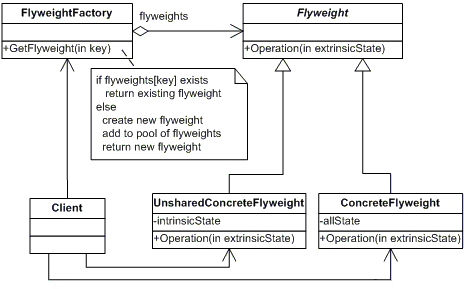

# Flyweight Design Pattern

The Flyweight design pattern is a structural pattern that focuses on optimizing memory usage by sharing a common state among multiple objects. It aims to reduce the number of objects created and to decrease memory footprint, particularly useful when dealing with a large number of similar objects.

## Table of Contents

-   [Components of Flyweight Design Pattern](#components-of-flyweight-design-pattern)
-   [Implementation](#implementation)

## Components of Flyweight Design Pattern

The Flyweight design pattern typically consists of the following components:

1. **Flyweight Interface/Class**:
    - Defines the interface through which flyweight objects can receive and act on extrinsic state.
2. **Concrete Flyweight Classes**:
    - Implements the Flyweight interface and represents objects that can be shared.
    - Stores intrinsic state (state that can be shared) and provides methods to manipulate intrinsic state if needed.
3. **Flyweight Factory**:
    - Manages a pool of flyweight objects.
    - Provides methods for clients to retrieve or create flyweight objects.
    - Ensures flyweight objects are shared appropriately to maximize reusability.
4. **Client**:
    - Uses flyweight objects to perform operations.
    - Maintains or passes extrinsic state to flyweight objects when needed.
    - Does not manage the lifecycle of flyweight objects directly but interacts with them via the factory.

## Implementation

