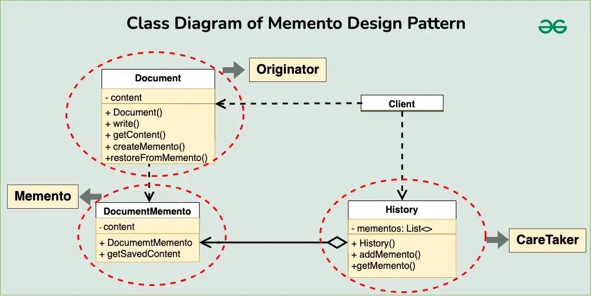

# Memento Design Pattern

The Memento design pattern is a behavioral design pattern used to capture and restore the internal state of an object without exposing its implementation details.

## Table of Contents

-   [Components of Memento Design Pattern](#components-of-memento-design-pattern)
-   [Implementation](#implementation)

## Components of Memento Design Pattern


1. **Originator**:
   This component is responsible for creating and managing the state of an object. It has methods to set and get the object’s state, and it can create Memento objects to store its state. The Originator communicates directly with the Memento to create snapshots of its state and to restore its state from a snapshot.

2. **Memento**:
   The Memento is an object that stores the state of the Originator at a particular point in time. It only provides a way to retrieve the state, without allowing direct modification. This ensures that the state remains

3. **Caretaker**:
   The Caretaker is responsible for keeping track of Memento objects. It doesn’t know the details of the state stored in the Memento but can request Mementos from the Originator to save or restore the object’s state.

4. **Client**:
   Typically represented as the part of the application or system that interacts with the Originator and Caretaker to achieve specific functionality. The client initiates requests to save or restore the state of the Originator through the Caretaker.

## Implementation



1. **Originator (Document)**:

    ```java
    public class Document {
        private String content;

        public Document(String content) {
            this.content = content;
        }

        public void write(String text) {
            this.content += text;
        }

        public String getContent() {
            return this.content;
        }

        public DocumentMemento createMemento() {
            return new DocumentMemento(this.content);
        }

        public void restoreFromMemento(DocumentMemento memento) {
            this.content = memento.getSavedContent();
        }
    }
    ```

2. **Memento**:

    ```java
    public class DocumentMemento {
        private String content;

        public DocumentMemento(String content) {
            this.content = content;
        }

        public String getSavedContent() {
            return this.content;
        }
    }
    ```

3. **Caretaker(History)**:

    ```java
    import java.util.ArrayList;
    import java.util.List;

    public class History {
        private List<DocumentMemento> mementos;

        public History() {
            this.mementos = new ArrayList<>();
        }

        public void addMemento(DocumentMemento memento) {
            this.mementos.add(memento);
        }

        public DocumentMemento getMemento(int index) {
            return this.mementos.get(index);
        }
    }
    ```

4. **Client**:

    ```java
    public class Main {
        public static void main(String[] args) {
            Document document = new Document("Initial content\n");
            History history = new History();

            // Write some content
            document.write("Additional content\n");
            history.addMemento(document.createMemento());

            // Write more content
            document.write("More content\n");
            history.addMemento(document.createMemento());

            // Restore to previous state
            document.restoreFromMemento(history.getMemento(1));

            // Print document content
            System.out.println(document.getContent());
        }
    }
    ```
