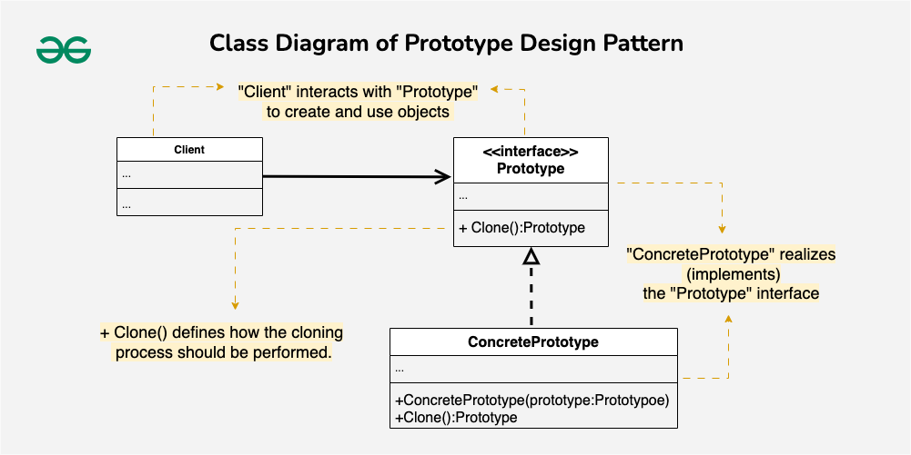
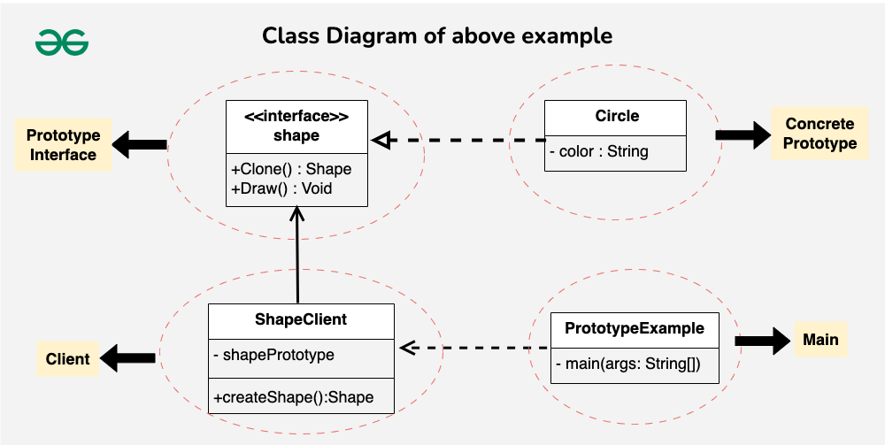

# Prototype Design Pattern

The Prototype Design Pattern is a creational pattern that enables the creation of new objects by copying an existing object. Prototype allows us to hide the complexity of making new instances from the client. The concept is to copy an existing object rather than create a new instance from scratch, something that may include costly operations. The existing object acts as a prototype and contains the state of the object.

## Table of Contents
## Table of Contents
- [Components of Prototype Design Pattern](#components-of-prototype-design-pattern)
  - [Prototype Interface or Abstract Class](#prototype-interface-or-abstract-class)
  - [Concrete Prototype](#concrete-prototype)
  - [Client](#client)
  - [Clone Method](#clone-method)
- [Implementation](#implementation)
  - [Prototype Interface (Shape)](#prototype-interface-shape)
  - [Concrete Prototype (Circle)](#concrete-prototype-circle)
  - [Concrete Prototype (Rectangle)](#concrete-prototype-rectangle)
  - [Client (ShapeClient)](#client-shapeclient)
## Components of Prototype Design Pattern

### Prototype Interface or Abstract Class
The **Prototype Interface** or **Abstract Class** declares the method(s) for cloning an object. It defines the common interface that concrete prototypes must implement, ensuring that all prototypes can be cloned in a consistent manner.
- The main role is to provide a blueprint for creating new objects by specifying the cloning contract.
- It declares the clone method, which concrete prototypes implement to produce copies of themselves.
### Concrete Prototype
The **Concrete Prototype** is a class that implements the prototype interface or extends the abstract class. It’s the class representing a specific type of object that you want to clone.

 It defines the details of how the cloning process should be carried out for instances of that class.
- Implements the clone method declared in the prototype interface, providing the cloning logic specific to the class.
### Client
The **Client** is the code or module that requests the creation of new objects by interacting with the prototype. It initiates the cloning process without being aware of the concrete classes involved.
### Clone Method
The **Clone Method** is declared in the prototype interface or abstract class. It specifies how an object should be copied or cloned. Concrete prototypes implement this method to define their unique cloning behavior. It Describes how the object’s internal state should be duplicated to create a new, independent instance.
## Implementation

### Prototype Interface (Shape)
We define an interface called `Shape` that acts as the prototype.It declares two methods: `clone()` for making a copy of itself and `draw()` for drawing the shape.

```java
// This is like a blueprint for creating shapes.
// It says every shape should be able to clone itself and draw.
public interface Shape {
	Shape clone(); // Make a copy of itself
	void draw(); // Draw the shape
}
```
### Concrete Prototype (Circle)
We implement the `Shape` interface with a concrete class `Circle`. The Circle class has a private field color and a constructor to set the color when creating a circle. It implements the `clone()` method to create a copy of itself (a new Circle with the same color).The `draw()` method is implemented to print a message indicating how the circle is drawn.

```java
// This is a specific shape, a circle, implementing the Shape interface.
// It can create a copy of itself (clone) and draw in its own way.
public class Circle implements Shape {
	private String color;

	// When you create a circle, you give it a color.
	public Circle(String color) {
		this.color = color;
	}

	// This creates a copy of the circle.
	@Override
	public Shape clone() {
		return new Circle(this.color);
	}

	// This is how a circle draws itself.
	@Override
	public void draw() {
		System.out.println("Drawing a " + color + " circle.");
	}
}
```
### Client (ShapeClient)
We create a client class, `ShapeClient`, which will use the prototype to create new shapes. The client has a field `shapePrototype` representing the prototype it will use. The constructor takes a `Shape` prototype, and there’s a method `createShape()` that creates a new shape using the prototype’s `clone()` method.