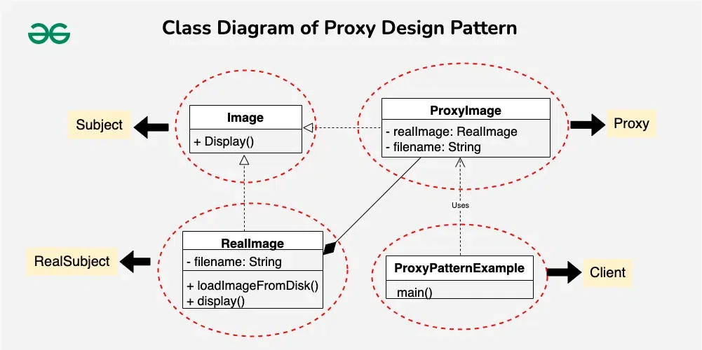

# Proxy Design Pattern

The **Proxy Design Pattern** is a structural design pattern that provides a surrogate or placeholder for another object to control access to it. This pattern is useful when you want to add an extra layer of control over access to an object. The proxy acts as an intermediary, controlling access to the real object.

## Table of Contents

1. [Components of Proxy Design Pattern](#components-of-proxy-design-pattern)

## Components of Proxy Design Pattern

1. Subject
    - The Subject is an interface or an abstract class that defines the common interface shared by the RealSubject and Proxy classes. It declares the methods that the Proxy uses to control access to the RealSubject.
    - Declares the common interface for both RealSubject and Proxy.
    - Usually includes the methods that the client code can invoke on the RealSubject and the Proxy.
2. RealSubject
    - The RealSubject is the actual object that the Proxy represents. It contains the real implementation of the business logic or the resource that the client code wants to access.
    - It Implements the operations declared by the Subject interface.
    - Represents the real resource or object that the Proxy controls access to. 3. Proxy
3. The Proxy:

    - Acts as a surrogate or placeholder for the RealSubject. It controls access to the real object and may provide additional functionality such as lazy loading, access control, or logging.

    - Implements the same interface as the RealSubject (Subject).
    - Maintains a reference to the RealSubject.
    - Controls access to the RealSubject, adding additional logic if necessary.

### Implementation



1.  Subject (Image Interface):
    The Image interface declares the common methods for displaying images, acting as a blueprint for both the real and proxy objects. In this design, it defines the display() method that both RealImage and ProxyImage must implement. This ensures a uniform interface for clients interacting with image objects.

    ```java
    // Subject
    interface Image {
        void display();
    }

    ```

2.  RealSubject (RealImage Class):
    The RealImage class represents the real object that the proxy will control access to.

    -   It implements the Image interface, providing concrete implementations for loading and displaying images from disk.
    -   The constructor initializes the image file name, and the display() method is responsible for loading the image if not already loaded and then displaying it.

    ```java
    // RealSubject
    class RealImage implements Image {
        private String filename;

        public RealImage(String filename) {
            this.filename = filename;
            loadImageFromDisk();
        }

        private void loadImageFromDisk() {
            System.out.println("Loading image: " + filename);
        }

        public void display() {
            System.out.println("Displaying image: " + filename);
        }
    }
    ```

3.  Proxy (ProxyImage Class):
    The ProxyImage class acts as a surrogate for the RealImage. It also implements the Image interface, maintaining a reference to the real image object.

    -   The display() method in the proxy checks whether the real image has been loaded; if not, it creates a new instance of RealImage and delegates the display() call to it.
    -   This lazy loading mechanism ensures that the real image is loaded only when necessary.

    ```java
    // Proxy
    class ProxyImage implements Image {
        private RealImage realImage;
        private String filename;

        public ProxyImage(String filename) {
            this.filename = filename;
        }

        public void display() {
            if (realImage == null) {
                realImage = new RealImage(filename);
            }
            realImage.display();
        }
    }
    ```

    4. Client:

    ```java
    // Client code
    public class ProxyPatternExample {
        public static void main(String[] args) {
            Image image = new ProxyImage("example.jpg");

            // Image will be loaded from disk only when display() is called
            image.display();

            // Image will not be loaded again, as it has been cached in the Proxy
            image.display();
        }
    }
    ```
