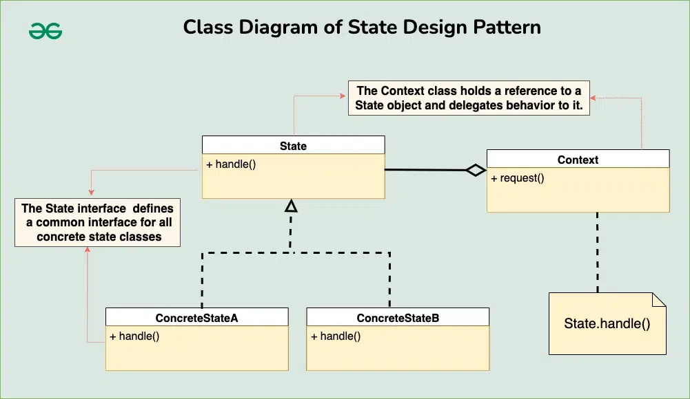

# State Design Pattern

The State design pattern is a behavioral software design pattern that allows an object to alter its behavior when its internal state changes. It achieves this by encapsulating the object’s behavior within different state objects, and the object itself dynamically switches between these state objects depending on its current state.

