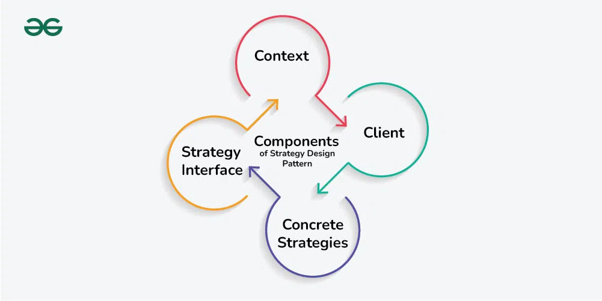

# Strategy Design Pattern

The Strategy Design Pattern defines a family of algorithms, encapsulates each one, and makes them interchangeable, allowing clients to switch algorithms dynamically without altering the code structure.

## Table of Contents

-   [Characteristics of the Strategy Design Pattern](#characteristics-of-the-strategy-design-pattern)
-   [Components of the Strategy Design Pattern](#components-of-the-strategy-design-pattern)
    -   [Context](#context)
    -   [Strategy Interface](#strategy-interface)
    -   [Concrete Strategies](#concrete-strategies)
    -   [Client](#client)
-   [Communication between the Components](#communication-between-the-components)
    -   [Client to Context](#client-to-context)
    -   [Context to Strategy](#context-to-strategy)
    -   [Strategy to Context](#strategy-to-context)
    -   [Strategy Interface as Contract](#strategy-interface-as-contract)
    -   [Decoupled Communication](#decoupled-communication)
-   [Implementation](#implementation)
    -   [SortingContext](#sortingcontext)
    -   [SortingStrategy (Interface)](#sortingstrategy-interface)
    -   [Concrete Strategies](#concrete-strategies-1)

## Characteristics of the Strategy Design Pattern

The Strategy Design Pattern exhibits several key characteristics that make it distinctive and effective for managing algorithm variations in software systems:

-   **It defines a family of algorithms**: The pattern allows you to encapsulate multiple algorithms or behaviors into separate classes, known as strategies.
-   **It encapsulates behaviors**: Each strategy encapsulates a specific behavior or algorithm, providing a clean and modular way to manage different variations or implementations.
-   **It enables dynamic behavior switching**: The pattern enables clients to switch between different strategies at runtime, allowing for flexible and dynamic behavior changes.
-   **It promotes object collaboration**: The pattern encourages collaboration between a context object and strategy objects, where the context delegates the execution of a behavior to a strategy object.

## Components of the Strategy Design Pattern



### Context

The **Context** is a class or object that holds a reference to a strategy object and delegates the task to it.

It acts as the interface between the client and the strategy, providing a unified way to execute the task without knowing the details of how it’s done.
The Context maintains a reference to a strategy object and calls its methods to perform the task, allowing for interchangeable strategies to be used.

### Strategy Interface

The **Strategy Interface** is an interface or abstract class that defines a set of methods that all concrete strategies must implement.

It serves as a contract, ensuring that all strategies adhere to the same set of rules and can be used interchangeably by the Context.
By defining a common interface, the Strategy Interface allows for decoupling between the Context and the concrete strategies, promoting flexibility and modularity in the design.

### Concrete Strategies

**Concrete Strategies** are the various implementations of the Strategy Interface. Each concrete strategy provides a specific algorithm or behavior for performing the task defined by the Strategy Interface.

Concrete strategies encapsulate the details of their respective algorithms and provide a method for executing the task.
They are interchangeable and can be selected and configured by the client based on the requirements of the task.

### Client

The **Client** is responsible for selecting and configuring the appropriate strategy and providing it to the Context.

It knows the requirements of the task and decides which strategy to use based on those requirements.
The client creates an instance of the desired concrete strategy and passes it to the Context, enabling the Context to use the selected strategy to perform the task.

## Communication between the Components

In the Strategy Design Pattern, communication between the components occurs in a structured and decoupled manner. Here’s how the components interact with each other:

-   **Client to Context**:
    -   The **Client**, which knows the requirements of the task, interacts with the **Context** to initiate the task execution.
    -   The **Client** selects an appropriate strategy based on the task requirements and provides it to the **Context**.
-   **Context to Strategy**:
    -   The Context holds a reference to the selected strategy and delegates the task to it.
    -   The Context invokes a method on the strategy object, triggering the execution of the specific algorithm or behavior encapsulated within the strategy.
-   **Strategy to Context**:
    -   Once the strategy completes its execution, it may return a result or perform any necessary actions.
    -   The **strategy** communicates the result or any relevant information back to the **Context**, which may further process or utilize the result as needed.
-   **Strategy Interface as Contract**:
    -   The **Strategy Interface** serves as a contract that defines a set of methods that all concrete strategies must implement.
        The Context communicates with strategies through the common interface, promoting interchangeability and decoupling.
-   **Decoupled Communication**:
    -   Communication between the components is decoupled, meaning that the Context does not need to know the specific details of how each strategy implements the task.
    -   Strategies can be swapped or replaced without impacting the client or other strategies, as long as they adhere to the common interface.

## Implementation


### SortingContext

```java
public class SortingContext {
    private SortingStrategy sortingStrategy;

    public SortingContext(SortingStrategy sortingStrategy) {
        this.sortingStrategy = sortingStrategy;
    }

    public void setSortingStrategy(SortingStrategy sortingStrategy) {
        this.sortingStrategy = sortingStrategy;
    }

    public void performSort(int[] array) {
        sortingStrategy.sort(array);
    }
}
```

### SortingStrategy (Interface)

```java
public interface SortingStrategy {
    void sort(int[] array);
}
```

### Concrete Strategies

```java
// BubbleSortStrategy
public class BubbleSortStrategy implements SortingStrategy {
	@Override
	public void sort(int[] array) {
		// Implement Bubble Sort algorithm
		System.out.println("Sorting using Bubble Sort");
	}
}

// MergeSortStrategy
public class MergeSortStrategy implements SortingStrategy {
	@Override
	public void sort(int[] array) {
		// Implement Merge Sort algorithm
		System.out.println("Sorting using Merge Sort");
	}
}

// QuickSortStrategy
public class QuickSortStrategy implements SortingStrategy {
	@Override
	public void sort(int[] array) {
		// Implement Quick Sort algorithm
		System.out.println("Sorting using Quick Sort");
	}
}
```
