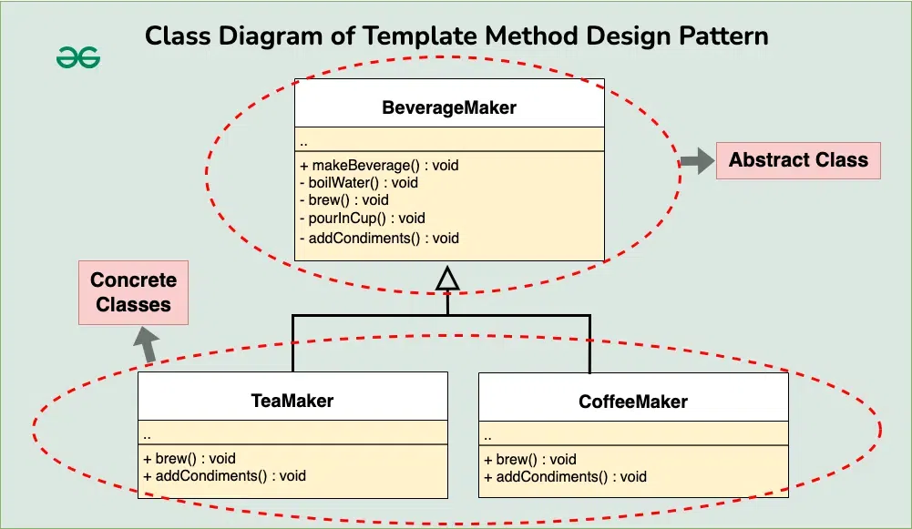

# Template Method Design Pattern

The Template Method design pattern is a behavioral design pattern that defines the skeleton of an algorithm in a superclass but allows subclasses to override specific steps of the algorithm without changing its structure.


## Table of Contents

-   [Components of Template Method Design Pattern](#components-of-template-method-design-pattern)
-   [Implementation](#implementation)

## Components of Template Method Design Pattern

1. **Abstract Class (or Interface)**:
   This is the superclass that defines the template method. It provides a skeleton for the algorithm, where certain steps are defined but others are left abstract or defined as hooks that subclasses can override. It may also include concrete methods that are common to all subclasses and are used within the template method.

2. **Template Method**:
   This is the method within the abstract class that defines the overall algorithm structure by calling various steps in a specific order. It’s often declared as final to prevent subclasses from changing the algorithm’s structure. The template method usually consists of a series of method calls (either abstract or concrete) that make up the algorithm’s steps.

3. **Abstract (or Hook) Methods**:
   These are methods declared within the abstract class but not implemented. They serve as placeholders for steps in the algorithm that should be implemented by subclasses. Subclasses must provide concrete implementations for these methods to complete the algorithm.

4. **Concrete Subclasses**:
   These are the subclasses that extend the abstract class and provide concrete implementations for the abstract methods defined in the superclass. Each subclass can override certain steps of the algorithm to customize the behavior without changing the overall structure.

## Implementation



1. **Abstract Class**:

    ```java
    // Abstract class defining the template method
    abstract class BeverageMaker {
        // Template method defining the overall process
        public final void makeBeverage() {
            boilWater();
            brew();
            pourInCup();
            addCondiments();
        }

        // Abstract methods to be implemented by subclasses
        abstract void brew();
        abstract void addCondiments();

        // Common methods
        void boilWater() {
            System.out.println("Boiling water");
        }

        void pourInCup() {
            System.out.println("Pouring into cup");
        }
    }
    ```

2. **Concrete Class (TeaMaker)**:

    ```java
    // Concrete subclass for making tea
    class TeaMaker extends BeverageMaker {
        // Implementing abstract methods
        @Override
        void brew() {
            System.out.println("Steeping the tea");
        }

        @Override
        void addCondiments() {
            System.out.println("Adding lemon");
        }
    }
    ```

3. **Concrete Class (CoffeeMaker)**:

    ```java
    // Concrete subclass for making coffee
    class CoffeeMaker extends BeverageMaker {
        // Implementing abstract methods
        @Override
        void brew() {
            System.out.println("Dripping coffee through filter");
        }

        @Override
        void addCondiments() {
            System.out.println("Adding sugar and milk");
        }
    }
    ```

4. **Client**:

    ```java
    public class Main {
        public static void main(String[] args) {
            System.out.println("Making tea:");
            BeverageMaker teaMaker = new TeaMaker();
            teaMaker.makeBeverage();

            System.out.println("\nMaking coffee:");
            BeverageMaker coffeeMaker = new CoffeeMaker();
            coffeeMaker.makeBeverage();
        }
    }
    ```
