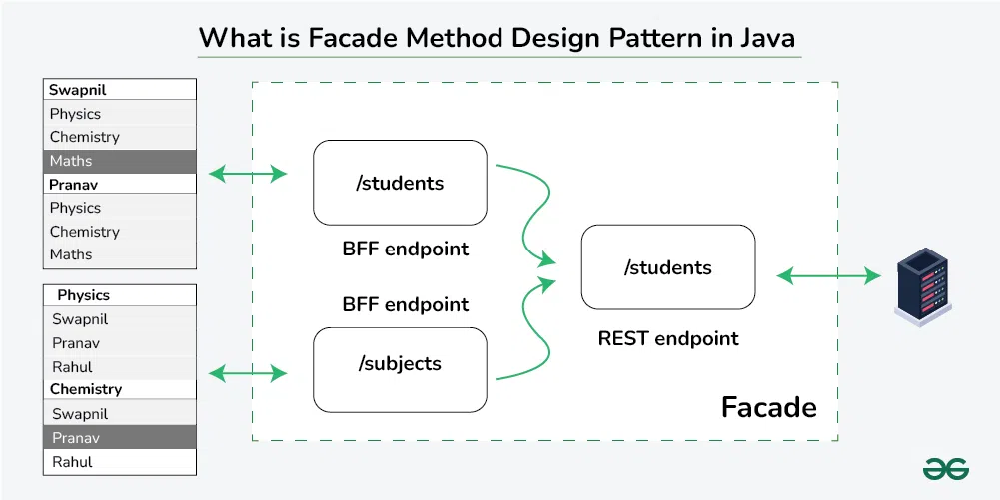
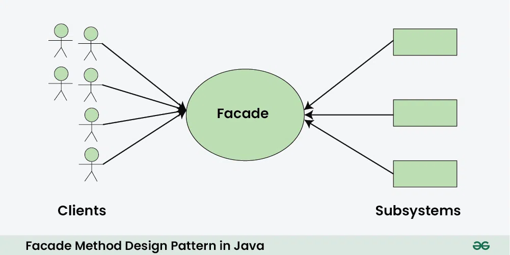

# Facade Design Pattern
**Facade Method Design Pattern** is a structural design pattern that provides a simplified interface to a complex subsystem. It acts as a “front door,” concealing the internal complexity of the subsystem and making it easier for clients to interact with it.



The functionalities of the Facade Method Design Patterns are :

- It involves a single class, known as the “facade,” which provides a simplified, higher-level interface to a set of interfaces in a subsystem.
- This simplification helps clients use the subsystem more easily without needing to understand its complexities.

## Key Component of Facade Method Design Pattern



- **Subsystem**:
    - Represents the complex part of the system that the Facade aims to simplify.
    Comprises multiple classes and interfaces that collaborate to provide a set of functionalities.
    - Clients typically should not interact with the Subsystem directly, but only through the Facade.
- **Facade**:
    - The heart of the pattern.
    - Acts as a simplified, unified interface to the Subsystem.
    - Clients interact exclusively with the Facade, not with the underlying Subsystem classes.
    - Typically has methods that delegate calls to appropriate classes within the Subsystem, hiding their complexity.
- **Client**:
    - Represents any code that needs to utilize the Subsystem’s functionality.
    - Interacts solely with the Facade, unaware of the Subsystem’s internal structure.
    - Benefits from the simplified interface provided by the Facade, making code more concise and maintainable.

## Implementation
### Subsystem Class:
We have 3 complex functionalities, AudioPlayer, VideoPlayer and ImageLoader:
```java
// AudioPlayer.java
class AudioPlayer {
    void playAudio(String filename) {
        System.out.println("Playing audio " + filename);
    }
}

// VideoPlayer.java
class VideoPlayer {
    void playVideo(String filename) {
        System.out.println("Playing video " + filename);
    }
}

// ImageLoader.java
class ImageLoader {
    void loadImage(String filename) {
        System.out.println("Loadig image " + filename);
    }
}
```

### Facade Class:
Here Facade class is Multimedia class.

```java
// Facade class
class MultimediaFacade {
    private AudioPlayer audioPlayer;
    private VideoPlayer videoPlayer;
    private ImageLoader imageLoader;

    public MultimediaFacade() {
        this.audioPlayer = new AudioPlayer();
        this.videoPlayer = new VideoPlayer();
        this.imageLoader = new ImageLoader();
    }

    void playMedia(String filename, String mediaType) {
        if (mediaType.equals("audio")) {
            audioPlayer.playAudio(filename);
        } else if (mediaType.equals("video")) {
            videoPlayer.playVideo(filename);
        } else if (mediaType.equals("image")) {
            imageLoader.loadImage(filename);
        } else {
            System.out.println("Unsupported media type " + mediaType);
        }
    }
}
```

### Client
```java
// Facade class
class MultimediaFacade {
    private AudioPlayer audioPlayer;
    private VideoPlayer videoPlayer;
    private ImageLoader imageLoader;

    public MultimediaFacade() {
        this.audioPlayer = new AudioPlayer();
        this.videoPlayer = new VideoPlayer();
        this.imageLoader = new ImageLoader();
    }

    void playMedia(String filename, String mediaType) {
        if (mediaType.equals("audio")) {
            audioPlayer.playAudio(filename);
        } else if (mediaType.equals("video")) {
            videoPlayer.playVideo(filename);
        } else if (mediaType.equals("image")) {
            imageLoader.loadImage(filename);
        } else {
            System.out.println("Unsupported media type " + mediaType);
        }
    }
}
```